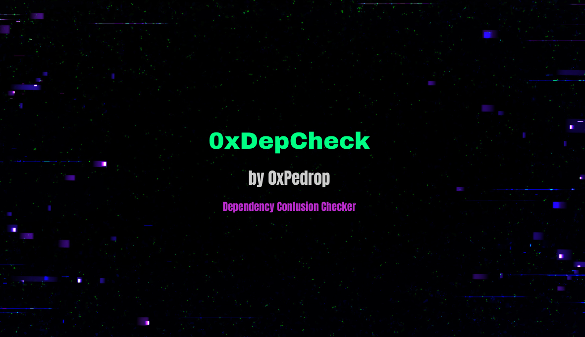

<p align="center">
  
</p>

# 0xDepCheck 🏴‍☠️

Ferramenta de validação para **Dependency Confusion**.

O 0xDepCheck verifica a disponibilidade de pacotes e organizações no registro público do NPM para confirmar se uma dependência interna pode ser sequestrada.

## Funcionalidades
* **Automated Validation:** Checa se o pacote retorna 404 (livre) no registro oficial.
* **Org Hijacking Check:** Verifica se a organização do escopo está disponível para registro.
* **Smart Logic:** Diferencia pacotes globais de pacotes escopados automaticamente.
* **Bug Bounty Ready:** Focado em agilizar o PoC (Proof of Concept) para reportes de segurança.

## ⚙️ Instalação Global
Para facilitar o uso durante o reconhecimento (recon), instale o `0xDepCheck` globalmente:

```
# Dar permissão de execução
chmod +x 0xDepCheck
```
```
# Mover para o diretório de binários
sudo mv 0xDepCheck /usr/local/bin/
```
## 🚀 Como usar  
1. Pacotes com Escopo (Org Hijacking)
  
Ideal para verificar se você pode sequestrar o namespace de uma empresa.  
```
0xDepCheck @minhacorp/auth-lib
```  
2. Pacotes sem Escopo (Registro Direto)
  
Ideal para pacotes internos que não utilizam o prefixo @.
```
0xDepCheck lib-interna-secreta
```
3. Modo Interativo
  
Inicie a ferramenta sem argumentos para digitar o nome manualmente:  

```
0xDepCheck
```
🧠 Lógica de Diagnóstico  
  
Status 200: Pacote já existe publicamente (Seguro).  
  
Status 404 (Pacote): Potencialmente vulnerável para registro direto.  
  
Status 404 (Organização): Crítico! O namespace inteiro da empresa pode ser registrado para hospedar o pacote.  
  
⚖️ Licença  

Este projeto está licenciado sob a Apache License 2.0 - veja o arquivo LICENSE para detalhes.  
  
Desenvolvido por 0xPedrop | github.com/0xPedrop
